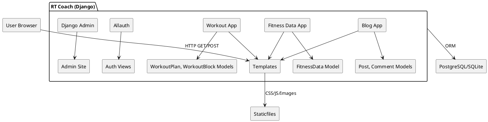
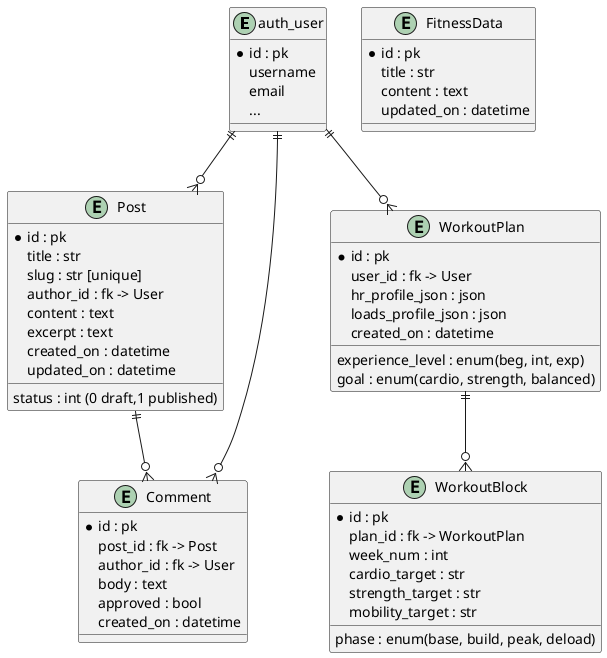
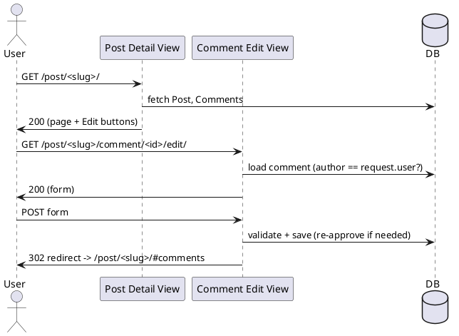
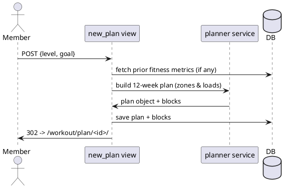

# RT Coach

A Django web app for publishing training content, capturing personal metrics (BMI, WHR, HR zones), and generating 12-week workout plans tailored by experience level and training goal.

* Blog with comments (auth required to post; moderation supported)
* Fitness Data calculators (BMI, waist–hip ratio, HR zones, 10RM→phase loads, CSV export)
* Workout planner (experience level & goal → 12-week periodised plan using user’s metrics)
* Admin dashboards for content management

**Deployed:** [click here](https://rt-coach-b6ced22546ee.herokuapp.com/)

---

## Table of Contents
1. [Project Goals](#project-goals)
2. [Users & Personas](#users--personas)
3. [User Profiles](#user-profiles)
3. [User Stories (MoSCoW / Acceptance Criteria)](#user-stories-moscow--acceptance-criteria)
4. [System Design](#system-design)
   1. [Component Diagram](#component-diagram)
   2. [Data Model (ERD)](#data-model-erd)
   3. [Key Flows](#key-flows)
5. [Features](#features)
6. [Design & Wireframes](#design--wireframes)
   1. [Design Principles](#design-principles)
   2. [Branding & UI](#branding--ui)
   3. [Wireframes](#wireframes)
7. [Non-Functional Requirements](#non-functional-requirements)
8. [Testing](#testing)
   1. [Automated Test Matrix](#automated-test-matrix)
   2. [Manual Test Scripts](#manual-test-scripts)
   3. [Accessibility & Performance](#accessibility--performance)
9. [Local Development](#local-development)
10. [Deployment](#deployment)
11. [Bugs](#bugs)
12. [Known Issues / Future Work](#known-issues--future-work)
13. [Credits](#credits)
14. [Appendix: Detailed Logic Tables](#appendix-detailed-logic-tables)

---

## Project Goals

* Provide accessible fitness calculators that work on any device.
* Convert inputs into actionable training guidance (e.g., heart-rate zones, loading tables).
* Let authenticated users generate personalised 12-week plans and download/share them.
* Keep admin and moderation simple through Django Admin.

---

## Users & Personas
* **Reader:** reads posts and calculators; not logged in.
* **Member:** logs in, comments on posts, generates workout plans.
* **Coach/Admin:** manages posts, pages, and moderates comments.

---


---

## User Profiles

* **Reader**
  * Goal: Consume training content without logging in.
  * Needs: Fast loading, readable typography, simple navigation.
  * Pain points: Paywalls, noisy UI, slow pages.

* **Member**
  * Goal: Comment on posts and generate personalised 12‑week plans from calculator inputs.
  * Needs: Clear forms, error messages, and the ability to export plans.
  * Pain points: Complex forms, unclear validation, losing work.

* **Coach / Admin**
  * Goal: Publish and manage posts, moderate comments, oversee content quality.
  * Needs: Efficient admin lists, filters, and moderation toggles.
  * Pain points: Manual busywork, confusing admin navigation.

## User Stories (MoSCoW + Acceptance Criteria)

### Blog

| ID | Priority | Story | Acceptance Criteria (Given/When/Then) |
| --- | --- | --- | --- |
| B1 | Must | As a reader, I want to browse posts so I can learn about training. | **Given** posts exist **When** I visit `/` **Then** I see a paginated list with titles, excerpts, dates. |
| B2 | Must | As a user, I want to read a full post and its comments. | **Given** a post exists **When** I open `/slug/` **Then** I see full content + comments count & list. |
| B3 | Must | As an authenticated user, I want to add a comment. | **Given** I’m logged in **When** I submit the comment form **Then** I’m redirected via PRG, my comment appears (pending if moderation is on). |
| B4 | Should | As a comment author, I want to edit my comment. | **Given** I authored the comment **When** I click Edit and submit changes **Then** The body updates, and moderation resets if configured. |

### Fitness Data

| ID | Priority | Story | Acceptance Criteria |
| --- | --- | --- | --- |
| F1 | Must | As a user, I want BMI computed from weight & height. | **Given** I enter kg/cm **When** I click Calculate **Then** I see BMI value + category. |
| F2 | Must | As a user, I want WHR computed from waist/hip. | **Given** I enter waist/hip **When** Calculate **Then** I see ratio. |
| F3 | Must | As a user, I want HR zones from age & RHR (Karvonen). | **Given** I enter age & RHR **When** Calculate **Then** I see Zone 1–5 ranges (bpm). |
| F4 | Should | As a user, I want 10RM inputs → phase loads. | **Given** I enter 10RM **When** Calculate **Then** I get Est. 1RM + Endurance/Hypertrophy/Strength/Power loads (rounded; unit toggle). |
| F5 | Could | As a user, I want CSV export of phase loads. | **Given** I’ve calculated **When** I click Download CSV **Then** A CSV downloads. |

### Workout Planner

| ID | Priority | Story | Acceptance Criteria |
| --- | --- | --- | --- |
| W1 | Must | As a member, I can create a plan by experience level & goal. | **Given** I’m logged in **When** I submit the form **Then** A plan is saved and shown at `/workout/plan/<id>/`. |
| W2 | Must | The plan uses my Fitness Data (HR zones / loads). | **Given** My inputs exist **When** I create a plan **Then** It derives HR targets and resistance loads per phase/week. |
| W3 | Should | I can export a plan as CSV. | **Given** Plan exists **When** I click Export CSV **Then** File downloads with weekly structure. |
| W4 | Could | I can view my plans list. | **Given** I’m logged in **When** I open `/workout/` **Then** I see my plans. |

### Accounts & Admin

| ID | Priority | Story | Acceptance Criteria |
| --- | --- | --- | --- |
| A1 | Must | As an admin, I want to manage posts/comments in Django admin. | Standard Django admin flows. |
| A2 | Should | As admin, I can toggle moderation. | Setting or field controls approval workflow. |

## System Design

### Component Diagram



### Data Model (ERD)



### Key Flows

**Comment (Edit) flow**



**Workout plan generation**



---

## Features

* **Blog:** listing, detail, comments (create & edit, PRG), moderation flag.
* **Fitness Data:** BMI/WHR/HR zones, 10RM phase loads, CSV export, kg/lb & rounding increments.
* **Workout:** new plan (experience/goal), plan detail, CSV export (stub exists, expand as needed).
* **Auth:** login/register/logout via Django Allauth.
* **Static:** fingerprinted static assets; per-app static directories and global.

---

## Design & Wireframes

### Design Principles
* **Clarity first:** clean typography, clear hierarchy, generous spacing.
* **Mobile-first:** layout builds from small screens up (flex/grid for responsive rows).
* **Consistency:** shared components for cards, tables, and forms; consistent CTA styles.
* **Feedback:** calculators and forms provide instant, accessible feedback (`aria-live="polite"`).
* **Performance:** optimized images (WebP where supported), lazy loading for non-critical visuals.

### Branding & UI
* **Color:** a restrained palette (primary for CTAs, neutral backgrounds for readability).  
* **Typography:** headings use a strong, readable sans-serif; body text uses a legible sans with 1.6 line-height.  
* **Components:**  
  - **Cards** for posts and workout blocks (soft shadows, rounded corners).  
  - **Tables** for exported/structured data (load tables, CSV outputs).  
  - **Forms** with clear labels, hints, and validation errors anchored near inputs.  
* **Icons:** lightweight icon set (e.g., Font Awesome) for subtle affordances (download, edit, comment).  
* **Accessibility:** focus outlines retained, sufficient contrast, labeled inputs, and skip-to-content link.

### Wireframes
> `docs/wireframes/wireframe-blog-mobile.png.png`,  
> `docs/wireframes/wireframe-fitness-tablet.png`,  
> `docs/wireframes/wireframe-workout-laptop.png'.

**Home (mobile)**  


**Fitness (tablet)**  


**Plan Detail (desktop)**  


---

## Non-Functional Requirements

* **Performance:** pages under 2s on typical broadband; static caching via Django staticfiles/CDN.
* **Accessibility:** WCAG 2.1 AA focus order, landmarks, ARIA `aria-live` used for calculators.
* **Security:** CSRF on forms, login required for plan routes and commenting, author-check for comment edits.
* **Observability:** server logs for POST/redirect and errors.
* **Portability:** SQLite dev, Postgres prod.

---

## Testing
### Automated Test Matrix

| Area | What | Test Type | Example |
| --- | --- | --- | --- |
| Models | Post, Comment relations & ordering | Unit | comment orders by `created_on`; `__str__` returns expected. |
| Views | PostList, post_detail | Unit/Integration | 200 responses; context keys exist; pagination. |
| Comments | create/edit permissions | Unit/Integration | only author can edit; unauth POST redirects to login. |
| Fitness Calc | BMI/WHR/HR zones logic | Unit | boundary clamps; Karvonen math; rounding. |
| 10RM Loads | 1RM estimate & phase multipliers | Unit | Epley 1RM; % table; unit conversions. |
| Workout Planner | plan saved; blocks created | Integration | POST `/workout/new/` creates plan + 12 blocks for 12 weeks. |
| Templates | script/css links resolve | Integration | `/static/blog/js/comments.js` returns 200. |

**Example pytest commands**

```bash
pytest
pytest -k "workout or fitness" -q
coverage run -m pytest && coverage html
flake8 .
black --check .
```

### Manual Test Scripts

**Navigation **

| Route | Expected |
| --- | --- |
| `/` | Post list loads; pagination works. |
| `/fitness/` | Calculators load; Calculate/Clear work; CSV export downloads. |
| `/workout/new/` (auth) | Form shows; POST yields redirect to plan detail. |
| `/workout/plan/<id>/` (auth) | Plan renders weekly table/cards; CSV export works. |

**Comment create/edit**

| Step | Expected |
| --- | --- |
| Submit as guest | Redirect to login message. |
| Submit as user | PRG redirect; success message; comment visible/pending. |
| Click Edit (author) | Edit form opens; save updates content; message shown. |

**10RM table**

| Step | Expected |
| --- | --- |
| Enter 10RM for “Squat” | Est. 1RM & phase loads populate. |
| Change units kg↔lb | Values convert; headers update. |
| Change increment | Rounding reflects selected increment. |
| CSV export | File contains headers & rows entered. |

### Accessibility & Performance


* **Axe / WAVE:** no critical issues; all form controls have labels; contrast OK.
* **Lighthouse:**
  * Performance ≥ 90 (hero images compressed; lazy loading where appropriate)
  * Accessibility ≥ 90
  * Best Practices ≥ 90
  * SEO ≥ 90


**Accessibility test table**

| Page | Tool | Result |
| --- | --- | --- |
| `/` | WAVE | 0 errors, 0 contrast issues |
| `/fitness/` | Axe | 0 critical, 0 serious |
| `/workout/new/` | Axe | 0 critical, 0 serious |


---
**HTML Validation**


**CSS Validation**

## Local Development

**Prerequisites**

* Python 3.13
* Node optional (for tooling only)

**Setup**

```bash
python -m venv .venv
. .venv/Scripts/activate  # Windows (Git Bash: source .venv/Scripts/activate)
pip install -r requirements.txt

# env
cp .env.example .env  # create and edit values as needed

python manage.py migrate
python manage.py createsuperuser
python manage.py runserver
```

**Static files (dev)**

```python
STATIC_URL = "/static/"
STATICFILES_DIRS = [BASE_DIR / "static"]   # exists
```

**Static files (prod)**

```bash
STATIC_ROOT = BASE_DIR / "staticfiles"
python manage.py collectstatic --noinput
```

---

## Deployment

* Set `DEBUG=False`, `ALLOWED_HOSTS`, database URL, and email backend in environment.
* Run `migrate` and `collectstatic`.
* (Optional) GitHub Actions CI/CD: run tests, flake8, black, collectstatic on build.

**Example GitHub Actions (pytest + flake8)**

```yaml
name: CI
on: [push, pull_request]
jobs:
  test:
    runs-on: ubuntu-latest
    steps:
      - uses: actions/checkout@v4
      - uses: actions/setup-python@v5
        with: { python-version: "3.11" }
      - run: pip install -r requirements.txt
      - run: flake8 .
      - run: black --check .
      - run: pytest -q
```
**JS Hint**

---

## Bugs

### Summary Table

| ID | Symptom | Root Cause | Fix |
|---|---|---|---|
| B01 | `OperationalError: no such column: blog_post.featured_image` | Model changed, DB not migrated | Make field nullable, run `makemigrations` + `migrate` |
| B02 | Post list slow / template stutter | N+1 queries (author/comments per post) | `select_related('author')`, `prefetch_related('comment_set')` |
| B03 | 500 on comment edit by non-author | Missing author permission check | Guard in view + 403/redirect |
| B04 | Pagination shows empty page / off-by-one | Queryset ordering + page param not validated | Order, clamp page, show last page when OOB |
| B05 | Static files 404 on Heroku | No `collectstatic`/Whitenoise config | Add `STATIC_ROOT`, run collectstatic, Whitenoise middleware order |
| B06 | 403 CSRF in prod | Missing `CSRF_TRUSTED_ORIGINS` for Heroku domain | Add `https://*.herokuapp.com` |
| B07 | 400 “Bad Request” on prod | `ALLOWED_HOSTS` missing app hostname | Add Heroku host to `ALLOWED_HOSTS` |
| B08 | Calculator rounds down wrong | Using `parseInt` on decimals | Use `parseFloat` + explicit `Math.round` |
| B09 | CSV export downloads as plain text | Missing `Content-Disposition` / content type | Set `text/csv` and attachment filename |
| B10 | Planner weeks start at 0 | Loop index used as week number | Add `+1` and validate 1–12 |
| B11 | Template error when image missing | `post.featured_image.url` when null | Make field `null=True, blank=True` + template guard |
| B12 | Wrong order in blog feed across timezones | Naive vs aware datetimes | `USE_TZ=True`, ensure aware timestamps + `order_by('-created_on')` |

### Detailed Bugs & Fixes

#### B01 — `no such column: blog_post.featured_image`
**Expected:** Homepage renders post grid.  
**Actual:** 500 with `OperationalError` referencing `blog_post.featured_image`.

**Root cause:** Added `featured_image` to `Post` model but the SQLite schema wasn’t migrated.

**Fix (safe, without data loss):**
```python
# blog/models.py
from django.db import models
# If using Cloudinary: from cloudinary.models import CloudinaryField

class Post(models.Model):
    # ...
    featured_image = models.ImageField(upload_to="blog/", null=True, blank=True)
    # Or: featured_image = CloudinaryField("image", null=True, blank=True)
```

```bash
python manage.py makemigrations blog
python manage.py migrate
```

**Template guard:**
```django

  

```

---

#### B02 — N+1 queries on Post list
**Expected:** `/` renders quickly.  
**Actual:** Slow render; DB log shows many small queries.

**Fix:**
```python
class PostListView(ListView):
    model = Post
    paginate_by = 6
    queryset = (
        Post.objects.filter(status=1)
        .select_related("author")
        .prefetch_related("comment_set")
        .order_by("-created_on")
    )
```
---

#### B03 — Editing comments as non-author throws 500
**Fix:**
```python
from django.core.exceptions import PermissionDenied

def comment_edit(request, slug, id):
    comment = get_object_or_404(Comment, pk=id, post__slug=slug)
    if request.user != comment.author and not request.user.is_staff:
        raise PermissionDenied
    # proceed…
```
---

#### B04 — Pagination off-by-one / empty last page
**Fix:**
```python
from django.core.paginator import Paginator, EmptyPage

def list_view(request):
    qs = Post.objects.filter(status=1).order_by("-created_on")
    paginator = Paginator(qs, 6)
    page = request.GET.get("page", 1)
    try:
        posts = paginator.page(page)
    except EmptyPage:
        posts = paginator.page(paginator.num_pages)
    return render(request, "blog/index.html", {"post_list": posts})
```
---

#### B05 — Static files 404 in production
**Fix:**
```python
# settings.py
STATIC_URL = "/static/"
STATIC_ROOT = BASE_DIR / "staticfiles"

MIDDLEWARE = [
    "django.middleware.security.SecurityMiddleware",
    "whitenoise.middleware.WhiteNoiseMiddleware",
    # ...
]

STORAGES = {
  "staticfiles": {"BACKEND": "whitenoise.storage.CompressedManifestStaticFilesStorage"},
}
```
```bash
python manage.py collectstatic --noinput
```
---

#### B06 — CSRF failures on Heroku
**Fix:**
```python
CSRF_TRUSTED_ORIGINS = [
  "https://*.herokuapp.com",
  "https://rt-coach-b6ced22546ee.herokuapp.com",
]
```
---

#### B07 — 400 “Bad Request” in prod
**Fix:**
```python
ALLOWED_HOSTS = ["127.0.0.1", "localhost", "rt-coach-b6ced22546ee.herokuapp.com"]
```
---

#### B08 — Calculator rounding errors
**Fix (JS):**
```js
function roundTo(x, increment) {
  const n = parseFloat(x);
  const inc = parseFloat(increment);
  return Math.round(n / inc) * inc;
}
```
---

#### B09 — CSV export downloads as text
**Fix:**
```python
def plan_export_csv(request, id):
    plan = get_object_or_404(WorkoutPlan, pk=id, user=request.user)
    resp = HttpResponse(content_type="text/csv")
    resp["Content-Disposition"] = f'attachment; filename="plan-{plan.id}.csv' + '"'  # closing quote
    writer = csv.writer(resp)
    writer.writerow(["Week","Phase","Cardio","Strength","Mobility"])
    for b in plan.workoutblock_set.order_by("week_num"):
        writer.writerow([b.week_num, b.phase, b.cardio_target, b.strength_target, b.mobility_target])
    return resp
```
---

#### B10 — Planner weeks start at 0
**Fix:**
```python
for i in range(12):
    week_num = i + 1
    WorkoutBlock.objects.create(plan=plan, week_num=week_num, ...)
```
---

#### B11 — Template error when image missing
**Fix:** Guard in template (see B01).

---

#### B12 — Post ordering wrong across timezones
**Fix:**
```python
USE_TZ = True
TIME_ZONE = "UTC"
```
Ensure datetimes are aware; sort by `-created_on`.

### Validation (Before / After Snapshots)

| Area | Before | After |
|---|---|---|
| Home page render | 500 (`featured_image` column missing) | 200 OK; images render when present, guarded when null |
| Post list queries | ~1 + (N×2) queries | ~1 + 2 queries (with `select_related`/`prefetch_related`) |
| Comment edit (non-author) | 500 error | 403 PermissionDenied (or redirect) |
| Heroku static | 404s for CSS/JS | Served via Whitenoise; cache-busted filenames |
| CSRF in prod | 403 on POST | Successful POSTs with trusted origins |
| CSV export | Opens in browser as text | Prompts download `plan-<id>.csv` |

**Developer Commands**
```bash
python manage.py makemigrations blog
python manage.py migrate
python manage.py showmigrations blog
python manage.py collectstatic --noinput
python manage.py dbshell
.schema blog_post
.quit
```

---

## Known Issues / Future Work

* Workout builder currently creates a single plan per submission; add “My Plans” list view.
* Optional moderation toggle for comments.
* Persist fitness inputs to user profile for prefill.
* Add PDF export for plans.
* Add calendar integration (ICS).

---

## Credits

* Django, django-allauth, django-summernote
* Bootstrap 5, Font Awesome
* Images: assets (compressed via Squoosh)
* Thanks to mentors and collaborators 🙏

---

## Appendix: Detailed Logic Tables

### Heart-Rate Zones (Karvonen / HRR)

| Zone | %HRR | Formula |
| --- | --- | --- |
| 1 | 50–60% | `RHR + HRR*0.50 → RHR + HRR*0.60` |
| 2 | 60–70% | `RHR + HRR*0.60 → RHR + HRR*0.70` |
| 3 | 70–80% | `RHR + HRR*0.70 → RHR + HRR*0.80` |
| 4 | 80–90% | `RHR + HRR*0.80 → RHR + HRR*0.90` |
| 5 | 90–100% | `RHR + HRR*0.90 → RHR + HRR*1.00` |

### 10RM → 1RM & Phase Loads

| Item | Formula |
| --- | --- |
| Est. 1RM (Epley) | `1RM = 10RM * (1 + 10/30)` |
| Endurance | ~60% 1RM |
| Hypertrophy | ~72% 1RM |
| Strength | ~85% 1RM |
| Power | ~65% 1RM |
| Rounding | to user-selected increment; unit toggle kg/lb |

### 12-Week Periodisation (example template)

| Weeks | Phase | Cardio Focus | Strength Focus |
| --- | --- | --- | --- |
| 1–4 | Base | Z2 volume | Endurance % loads |
| 5–8 | Build | Z3 threshold | Hypertrophy % loads |
| 9–11 | Peak | Z4 efforts | Strength % loads |
| 12 | Deload | Z1–2 | ~50–60% loads |


