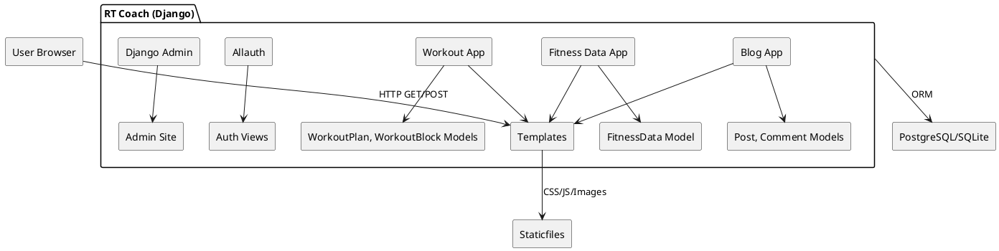
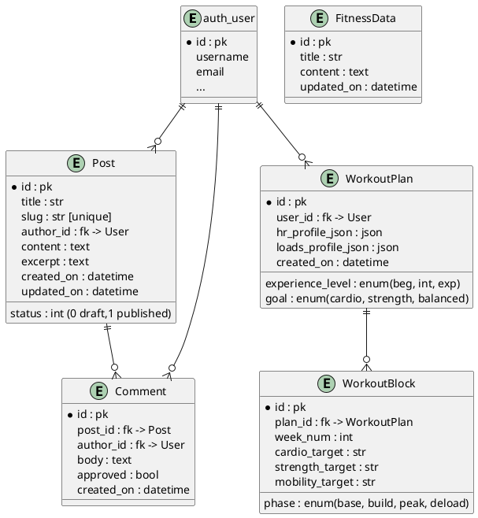
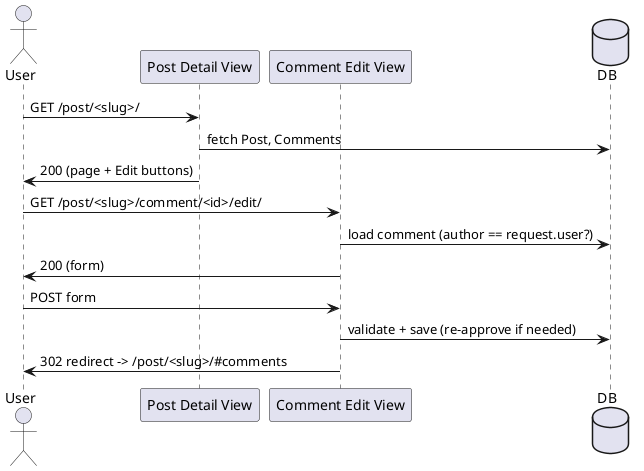
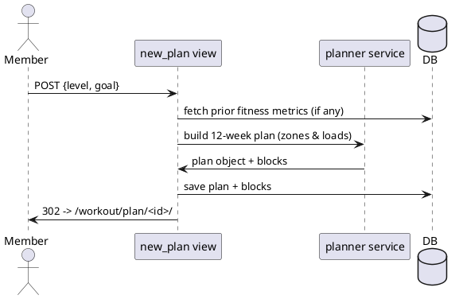

# RT Coach

A Django web app for publishing training content, capturing personal metrics (BMI, WHR, HR zones), and generating 12-week workout plans tailored by experience level and training goal.

* Blog with comments (auth required to post; moderation supported)
* Fitness Data calculators (BMI, waist–hip ratio, HR zones, 10RM→phase loads, CSV export)
* Workout planner (experience level & goal → 12-week periodised plan using user’s metrics)
* Admin dashboards for content management

**Deployed:** [click here](https://rt-coach-b6ced22546ee.herokuapp.com/)

---

## Table of Contents
1. [Project Goals](#project-goals)
2. [Users & Personas](#users--personas)
3. [User Stories (MoSCoW / Acceptance Criteria)](#user-stories-moscow--acceptance-criteria)
4. [System Design](#system-design)
   1. [Component Diagram](#component-diagram)
   2. [Data Model (ERD)](#data-model-erd)
   3. [Key Flows](#key-flows)
5. [Features](#features)
6. [Non-Functional Requirements](#non-functional-requirements)
7. [Testing](#testing)
   1. [Automated Test Matrix](#automated-test-matrix)
   2. [Manual Test Scripts](#manual-test-scripts)
   3. [Accessibility & Performance](#accessibility--performance)
8. [Local Development](#local-development)
9. [Deployment](#deployment)
10. [Known Issues / Future Work](#known-issues--future-work)
11. [Credits](#credits)
12. [Appendix: Detailed Logic Tables](#appendix-detailed-logic-tables)

---

## Project Goals

* Provide accessible fitness calculators that work on any device.
* Convert inputs into actionable training guidance (e.g., heart-rate zones, loading tables).
* Let authenticated users generate personalised 12-week plans and download/share them.
* Keep admin and moderation simple through Django Admin.

---

## Users & Personas

* **Reader:** reads posts and calculators; not logged in.
* **Member:** logs in, comments on posts, generates workout plans.
* **Coach/Admin:** manages posts, pages, and moderates comments.

---

## User Stories (MoSCoW + Acceptance Criteria)

### Blog

| ID | Priority | Story | Acceptance Criteria (Given/When/Then) |
| --- | --- | --- | --- |
| B1 | Must | As a reader, I want to browse posts so I can learn about training. | **G** posts exist **W** I visit `/` **T** I see a paginated list with titles, excerpts, dates. |
| B2 | Must | As a user, I want to read a full post and its comments. | **G** a post exists **W** I open `/slug/` **T** I see full content + comments count & list. |
| B3 | Must | As an authenticated user, I want to add a comment. | **G** I’m logged in **W** I submit the comment form **T** I’m redirected via PRG, my comment appears (pending if moderation is on). |
| B4 | Should | As a comment author, I want to edit my comment. | **G** I authored the comment **W** I click Edit and submit changes **T** The body updates, and moderation resets if configured. |

### Fitness Data

| ID | Priority | Story | Acceptance Criteria |
| --- | --- | --- | --- |
| F1 | Must | As a user, I want BMI computed from weight & height. | **G** I enter kg/cm **W** I click Calculate **T** I see BMI value + category. |
| F2 | Must | As a user, I want WHR computed from waist/hip. | **G** I enter waist/hip **W** Calculate **T** I see ratio. |
| F3 | Must | As a user, I want HR zones from age & RHR (Karvonen). | **G** I enter age & RHR **W** Calculate **T** I see Zone 1–5 ranges (bpm). |
| F4 | Should | As a user, I want 10RM inputs → phase loads. | **G** I enter 10RM **W** Calculate **T** I get Est. 1RM + Endurance/Hypertrophy/Strength/Power loads (rounded; unit toggle). |
| F5 | Could | As a user, I want CSV export of phase loads. | **G** I’ve calculated **W** I click Download CSV **T** A CSV downloads. |

### Workout Planner

| ID | Priority | Story | Acceptance Criteria |
| --- | --- | --- | --- |
| W1 | Must | As a member, I can create a plan by experience level & goal. | **G** I’m logged in **W** I submit the form **T** A plan is saved and shown at `/workout/plan/<id>/`. |
| W2 | Must | The plan uses my Fitness Data (HR zones / loads). | **G** My inputs exist **W** I create a plan **T** It derives HR targets and resistance loads per phase/week. |
| W3 | Should | I can export a plan as CSV. | **G** Plan exists **W** I click Export CSV **T** File downloads with weekly structure. |
| W4 | Could | I can view my plans list. | **G** I’m logged in **W** I open `/workout/` **T** I see my plans. |

### Accounts & Admin

| ID | Priority | Story | Acceptance Criteria |
| --- | --- | --- | --- |
| A1 | Must | As an admin, I want to manage posts/comments in Django admin. | Standard Django admin flows. |
| A2 | Should | As admin, I can toggle moderation. | Setting or field controls approval workflow. |

## System Design

### Component Diagram


### Data Model (ERD)



### Key Flows

**Comment (Edit) flow**



**Workout plan generation**



---

## Features

* **Blog:** listing, detail, comments (create & edit, PRG), moderation flag.
* **Fitness Data:** BMI/WHR/HR zones, 10RM phase loads, CSV export, kg/lb & rounding increments.
* **Workout:** new plan (experience/goal), plan detail, CSV export (stub exists, expand as needed).
* **Auth:** login/register/logout via Django Allauth.
* **Static:** fingerprinted static assets; per-app static directories and global.

---

## Non-Functional Requirements

* **Performance:** pages under 2s on typical broadband; static caching via Django staticfiles/CDN.
* **Accessibility:** WCAG 2.1 AA focus order, landmarks, ARIA `aria-live` used for calculators.
* **Security:** CSRF on forms, login required for plan routes and commenting, author-check for comment edits.
* **Observability:** server logs for POST/redirect and errors.
* **Portability:** SQLite dev, Postgres prod.

---

## Testing
### Automated Test Matrix

| Area | What | Test Type | Example |
| --- | --- | --- | --- |
| Models | Post, Comment relations & ordering | Unit | comment orders by `created_on`; `__str__` returns expected. |
| Views | PostList, post_detail | Unit/Integration | 200 responses; context keys exist; pagination. |
| Comments | create/edit permissions | Unit/Integration | only author can edit; unauth POST redirects to login. |
| Fitness Calc | BMI/WHR/HR zones logic | Unit | boundary clamps; Karvonen math; rounding. |
| 10RM Loads | 1RM estimate & phase multipliers | Unit | Epley 1RM; % table; unit conversions. |
| Workout Planner | plan saved; blocks created | Integration | POST `/workout/new/` creates plan + 12 blocks for 12 weeks. |
| Templates | script/css links resolve | Integration | `/static/blog/js/comments.js` returns 200. |

**Example pytest commands**

```bash
pytest
pytest -k "workout or fitness" -q
coverage run -m pytest && coverage html
flake8 .
black --check .
```

### Manual Test Scripts

**Navigation **

| Route | Expected |
| --- | --- |
| `/` | Post list loads; pagination works. |
| `/fitness/` | Calculators load; Calculate/Clear work; CSV export downloads. |
| `/workout/new/` (auth) | Form shows; POST yields redirect to plan detail. |
| `/workout/plan/<id>/` (auth) | Plan renders weekly table/cards; CSV export works. |

**Comment create/edit**

| Step | Expected |
| --- | --- |
| Submit as guest | Redirect to login message. |
| Submit as user | PRG redirect; success message; comment visible/pending. |
| Click Edit (author) | Edit form opens; save updates content; message shown. |

**10RM table**

| Step | Expected |
| --- | --- |
| Enter 10RM for “Squat” | Est. 1RM & phase loads populate. |
| Change units kg↔lb | Values convert; headers update. |
| Change increment | Rounding reflects selected increment. |
| CSV export | File contains headers & rows entered. |

### Accessibility & Performance


* **Axe / WAVE:** no critical issues; all form controls have labels; contrast OK.
* **Lighthouse:**
  * Performance ≥ 90 (hero images compressed; lazy loading where appropriate)
  * Accessibility ≥ 90
  * Best Practices ≥ 90
  * SEO ≥ 90

**Accessibility test table**

| Page | Tool | Result |
| --- | --- | --- |
| `/` | WAVE | 0 errors, 0 contrast issues |
| `/fitness/` | Axe | 0 critical, 0 serious |
| `/workout/new/` | Axe | 0 critical, 0 serious |

---

## Local Development

**Prerequisites**

* Python 3.11+ (you’re on 3.13, good)
* Node optional (for tooling only)

**Setup**

```bash
python -m venv .venv
. .venv/Scripts/activate  # Windows (Git Bash: source .venv/Scripts/activate)
pip install -r requirements.txt

# env
cp .env.example .env  # create and edit values as needed

python manage.py migrate
python manage.py createsuperuser
python manage.py runserver
```

**Static files (dev)**

```python
STATIC_URL = "/static/"
STATICFILES_DIRS = [BASE_DIR / "static"]   # exists
```

**Static files (prod)**

```bash
STATIC_ROOT = BASE_DIR / "staticfiles"
python manage.py collectstatic --noinput
```

---

## Deployment

* Set `DEBUG=False`, `ALLOWED_HOSTS`, database URL, and email backend in environment.
* Run `migrate` and `collectstatic`.
* (Optional) GitHub Actions CI/CD: run tests, flake8, black, collectstatic on build.

**Example GitHub Actions (pytest + flake8)**

```yaml
name: CI
on: [push, pull_request]
jobs:
  test:
    runs-on: ubuntu-latest
    steps:
      - uses: actions/checkout@v4
      - uses: actions/setup-python@v5
        with: { python-version: "3.11" }
      - run: pip install -r requirements.txt
      - run: flake8 .
      - run: black --check .
      - run: pytest -q
```

---

## Known Issues / Future Work

* Workout builder currently creates a single plan per submission; add “My Plans” list view.
* Optional moderation toggle for comments.
* Persist fitness inputs to user profile for prefill.
* Add PDF export for plans.
* Add calendar integration (ICS).

---

## Credits

* Django, django-allauth, django-summernote
* Bootstrap 5, Font Awesome
* Images: your assets (compressed via Squoosh)
* Thanks to mentors and collaborators 🙏

---

## Appendix: Detailed Logic Tables

### Heart-Rate Zones (Karvonen / HRR)

| Zone | %HRR | Formula |
| --- | --- | --- |
| 1 | 50–60% | `RHR + HRR*0.50 → RHR + HRR*0.60` |
| 2 | 60–70% | `RHR + HRR*0.60 → RHR + HRR*0.70` |
| 3 | 70–80% | `RHR + HRR*0.70 → RHR + HRR*0.80` |
| 4 | 80–90% | `RHR + HRR*0.80 → RHR + HRR*0.90` |
| 5 | 90–100% | `RHR + HRR*0.90 → RHR + HRR*1.00` |

### 10RM → 1RM & Phase Loads

| Item | Formula |
| --- | --- |
| Est. 1RM (Epley) | `1RM = 10RM * (1 + 10/30)` |
| Endurance | ~60% 1RM |
| Hypertrophy | ~72% 1RM |
| Strength | ~85% 1RM |
| Power | ~65% 1RM |
| Rounding | to user-selected increment; unit toggle kg/lb |

### 12-Week Periodisation (example template)

| Weeks | Phase | Cardio Focus | Strength Focus |
| --- | --- | --- | --- |
| 1–4 | Base | Z2 volume | Endurance % loads |
| 5–8 | Build | Z3 threshold | Hypertrophy % loads |
| 9–11 | Peak | Z4 efforts | Strength % loads |
| 12 | Deload | Z1–2 | ~50–60% loads |


