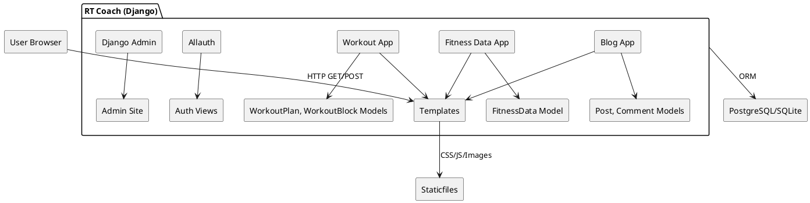

# RT Coach

A Django web app for publishing training content, capturing personal metrics (BMI, WHR, HR zones), and generating 12-week workout plans tailored by experience level and training goal.

* Blog with comments (auth required to post; moderation supported)
* Fitness Data calculators (BMI, waist–hip ratio, HR zones, 10RM→phase loads, CSV export)
* Workout planner (experience level & goal → 12-week periodised plan using user’s metrics)
* Admin dashboards for content management

**Deployed:** [click here](https://rt-coach-b6ced22546ee.herokuapp.com/)

---

## Table of Contents
1. [Project Goals](#project-goals)
2. [Users & Personas](#users--personas)
3. [User Stories (MoSCoW / Acceptance Criteria)](#user-stories-moscow--acceptance-criteria)
4. [System Design](#system-design)
   1. [Component Diagram](#component-diagram)
   2. [Data Model (ERD)](#data-model-erd)
   3. [Key Flows](#key-flows)
5. [Features](#features)
6. [Non-Functional Requirements](#non-functional-requirements)
7. [Testing](#testing)
   1. [Automated Test Matrix](#automated-test-matrix)
   2. [Manual Test Scripts](#manual-test-scripts)
   3. [Accessibility & Performance](#accessibility--performance)
8. [Local Development](#local-development)
9. [Deployment](#deployment)
10. [Known Issues / Future Work](#known-issues--future-work)
11. [Credits](#credits)
12. [Appendix: Detailed Logic Tables](#appendix-detailed-logic-tables)

---

## Project Goals

* Provide accessible fitness calculators that work on any device.
* Convert inputs into actionable training guidance (e.g., heart-rate zones, loading tables).
* Let authenticated users generate personalised 12-week plans and download/share them.
* Keep admin and moderation simple through Django Admin.

---

## Users & Personas

* **Reader:** reads posts and calculators; not logged in.
* **Member:** logs in, comments on posts, generates workout plans.
* **Coach/Admin:** manages posts, pages, and moderates comments.

---

## User Stories (MoSCoW + Acceptance Criteria)

### Blog

| ID | Priority | Story | Acceptance Criteria (Given/When/Then) |
| --- | --- | --- | --- |
| B1 | Must | As a reader, I want to browse posts so I can learn about training. | **G** posts exist **W** I visit `/` **T** I see a paginated list with titles, excerpts, dates. |
| B2 | Must | As a user, I want to read a full post and its comments. | **G** a post exists **W** I open `/slug/` **T** I see full content + comments count & list. |
| B3 | Must | As an authenticated user, I want to add a comment. | **G** I’m logged in **W** I submit the comment form **T** I’m redirected via PRG, my comment appears (pending if moderation is on). |
| B4 | Should | As a comment author, I want to edit my comment. | **G** I authored the comment **W** I click Edit and submit changes **T** The body updates, and moderation resets if configured. |

### Fitness Data

| ID | Priority | Story | Acceptance Criteria |
| --- | --- | --- | --- |
| F1 | Must | As a user, I want BMI computed from weight & height. | **G** I enter kg/cm **W** I click Calculate **T** I see BMI value + category. |
| F2 | Must | As a user, I want WHR computed from waist/hip. | **G** I enter waist/hip **W** Calculate **T** I see ratio. |
| F3 | Must | As a user, I want HR zones from age & RHR (Karvonen). | **G** I enter age & RHR **W** Calculate **T** I see Zone 1–5 ranges (bpm). |
| F4 | Should | As a user, I want 10RM inputs → phase loads. | **G** I enter 10RM **W** Calculate **T** I get Est. 1RM + Endurance/Hypertrophy/Strength/Power loads (rounded; unit toggle). |
| F5 | Could | As a user, I want CSV export of phase loads. | **G** I’ve calculated **W** I click Download CSV **T** A CSV downloads. |

### Workout Planner

| ID | Priority | Story | Acceptance Criteria |
| --- | --- | --- | --- |
| W1 | Must | As a member, I can create a plan by experience level & goal. | **G** I’m logged in **W** I submit the form **T** A plan is saved and shown at `/workout/plan/<id>/`. |
| W2 | Must | The plan uses my Fitness Data (HR zones / loads). | **G** My inputs exist **W** I create a plan **T** It derives HR targets and resistance loads per phase/week. |
| W3 | Should | I can export a plan as CSV. | **G** Plan exists **W** I click Export CSV **T** File downloads with weekly structure. |
| W4 | Could | I can view my plans list. | **G** I’m logged in **W** I open `/workout/` **T** I see my plans. |

### Accounts & Admin

| ID | Priority | Story | Acceptance Criteria |
| --- | --- | --- | --- |
| A1 | Must | As an admin, I want to manage posts/comments in Django admin. | Standard Django admin flows. |
| A2 | Should | As admin, I can toggle moderation. | Setting or field controls approval workflow. |

## System Design

### Component Diagram

