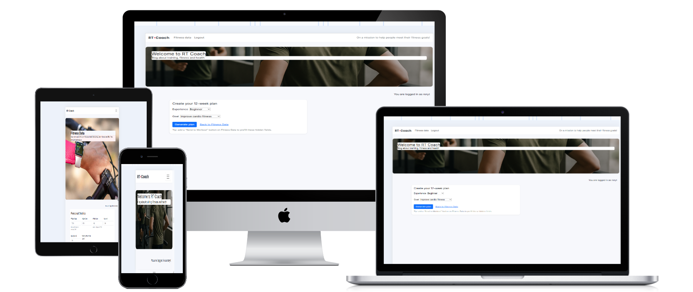
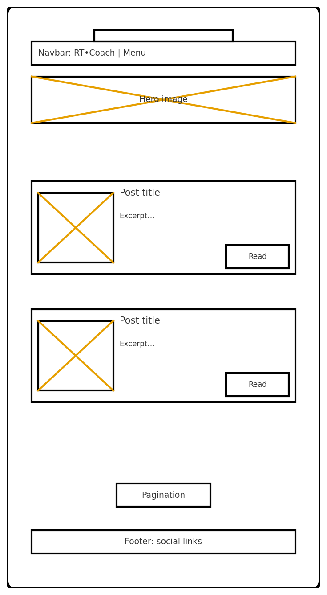
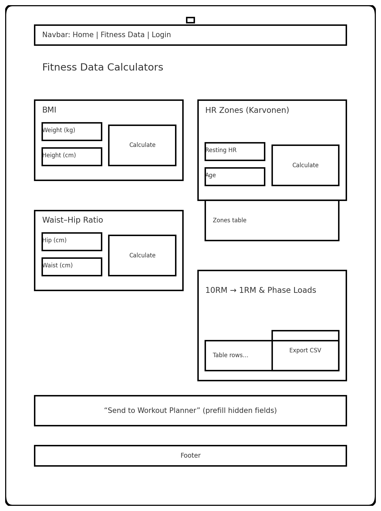
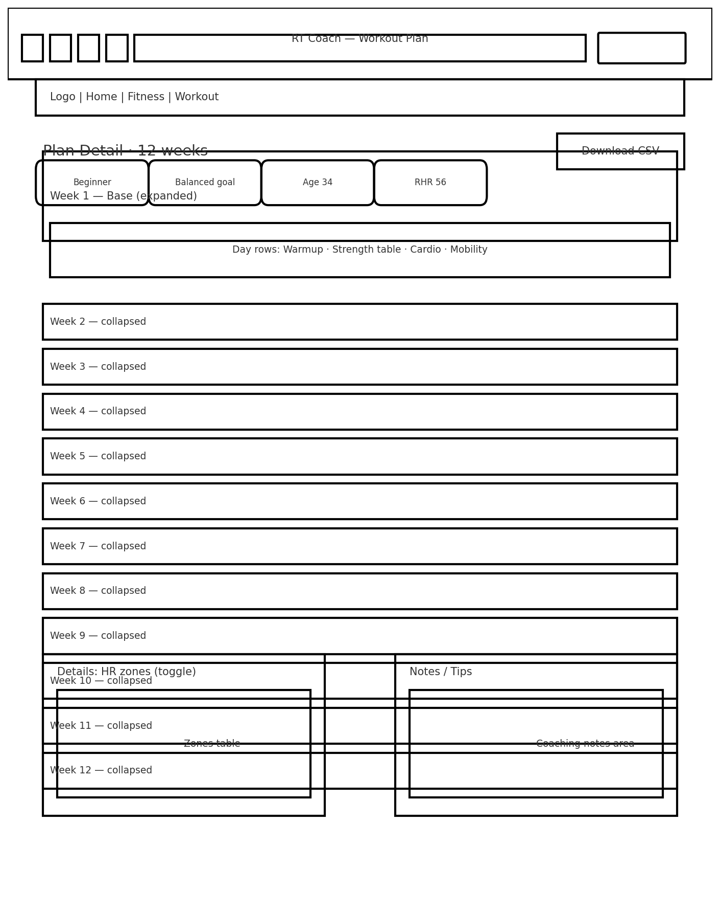
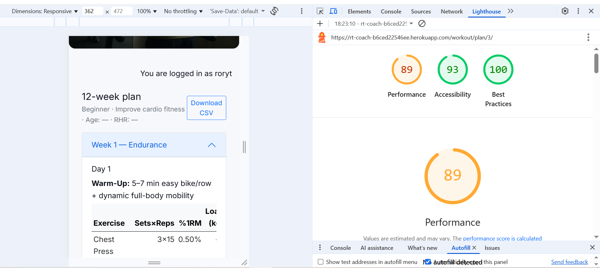
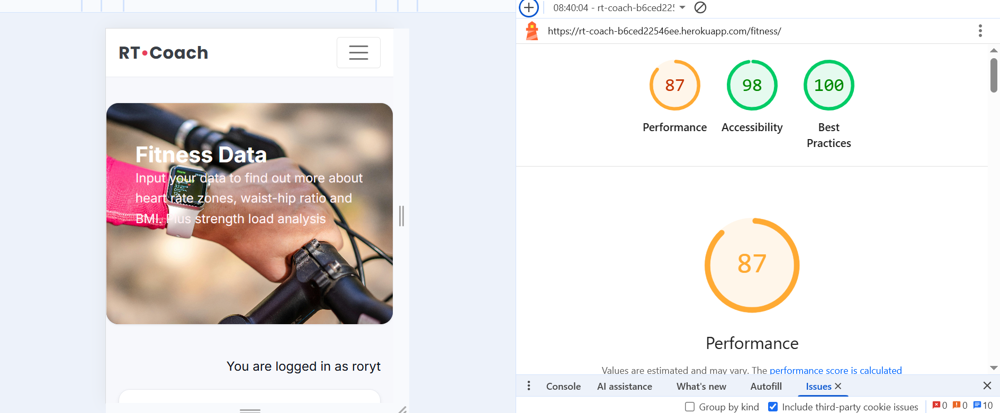
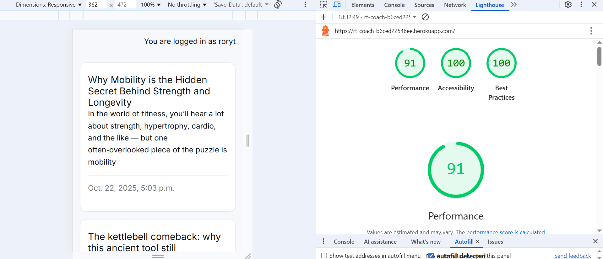
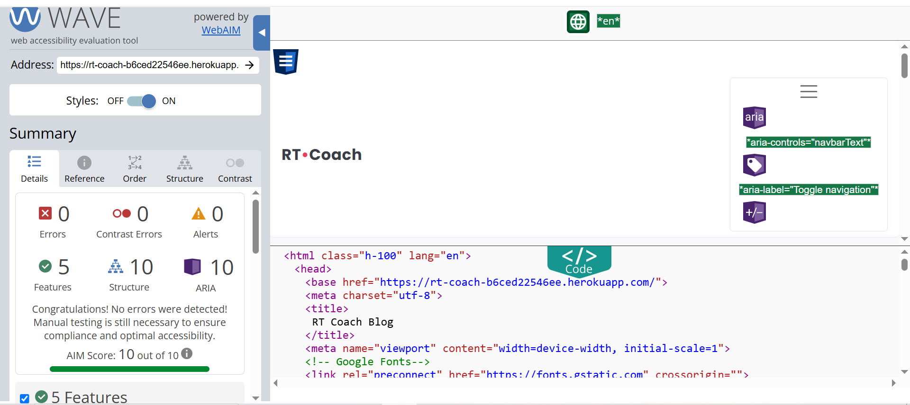
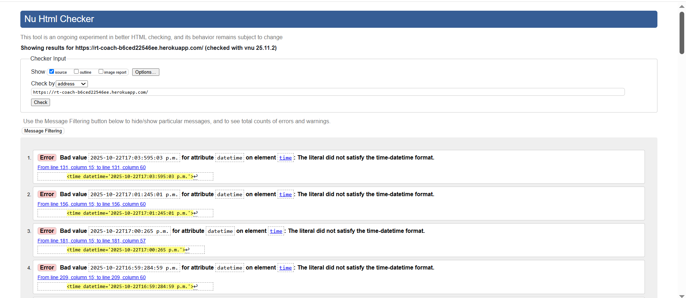
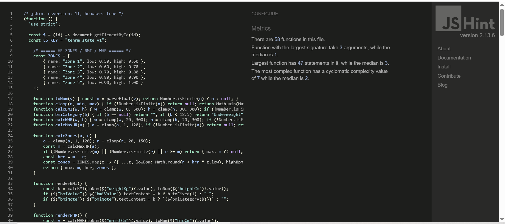

# RT Coach


![Github repository] ( https://github.com/rory-codes/rt-coach/)

---

## Overview
RT Coach is a Django web app that publishes training content, provides fitness calculators (BMI, waist–hip ratio, heart-rate zones, 10RM→phase loads), and generates 12-week workout plans tailored to user goals and experience level.
---

## Table of Contents
1. [UX](#ux)
   1. [Project Goals](#project-goals)
   2. [User Profiles](#user-profiles)
   3. [User Stories (MoSCoW)](#user-stories-moscow)
2. [Features](#features)
   1. [Existing Features](#existing-features)
   2. [Future Enhancements](#future-enhancements)
3. [Design](#design)
   1. [Design Principles](#design-principles)
   2. [Branding & UI](#branding--ui)
   3. [Wireframes](#wireframes)
4. [Non-Functional Requirements](#non-functional-requirements)
5. [Data Model](#data-model)
   1. [Entity–Relationship Diagram](#entityrelationship-diagram)
   2. [Schema Details](#schema-details)
6. [Accessibility](#accessibility)
7. [Security](#security)
8. [Technologies Used](#technologies-used)
9. [Testing](#testing)
   1. [Automated Test Matrix](#automated-test-matrix)
   2. [Manual Test Scripts](#manual-test-scripts)
   3. [Validators & Linters](#validators--linters)
   4. [Accessibility & Performance](#accessibility--performance)
10. [Bugs](#bugs)
    1. [Summary Table](#summary-table)
    2. [Detailed Bugs & Fixes](#detailed-bugs--fixes)
    3. [Known Issues & Future Work](#known-issues--future-work)
11. [Deployment](#deployment)
    1. [Local Development](#local-development)
    2. [Heroku Deployment](#heroku-deployment)
12. [Credits](#credits)
13. [Acknowledgements](#acknowledgements)
14. [Appendix: Detailed Logic Tables](#appendix-detailed-logic-tables)

---

## UX

### Project Goals
* Provide accessible, mobile-first calculators for fitness metrics.
* Generate personalised 12-week, periodised plans from user inputs.
* Allow members to comment on blog posts (with moderation).

### User Profiles
**Reader**  
* *Goal:* consume training content without logging in.  
* *Needs:* fast loading, readable typography, simple navigation.  
* *Pain points:* paywalls, noisy UI, slow pages.

**Member**  
* *Goal:* comment on posts and generate personalised 12-week plans.  
* *Needs:* clear forms, helpful error messages, CSV export.  
* *Pain points:* complex forms, unclear validation, losing work.

**Coach / Admin**  
* *Goal:* publish/manage posts, moderate comments.  
* *Needs:* efficient admin lists, filters, moderation toggles.  
* *Pain points:* manual busywork, confusing admin navigation.

### User Stories (MoSCoW)

#### Blog
| ID | Priority | Story | Acceptance Criteria (Given / When / Then) |
|---|---|---|---|
| B1 | Must | As a reader, I can browse posts to learn about training. | **Given** posts exist **When** I visit `/` **Then** I see a paginated list with title, excerpt, date. |
| B2 | Must | As a user, I can read a full post and its comments. | **Given** a post exists **When** I open `/\<slug>/` **Then** I see content and comments. |
| B3 | Must | As an authenticated user, I can add a comment. | **Given** I’m logged in **When** I submit the form **Then** I’m redirected (PRG) and my comment shows (pending until approved). |
| B4 | Should | As a comment author, I can edit my comment. | **Given** I own the comment **When** I save changes **Then** the body updates (and may return to pending if moderation is enabled). |

#### Fitness Data
| ID | Priority | Story | Acceptance Criteria |
|---|---|---|---|
| F1 | Must | Calculate BMI from weight/height. | Enter kg/cm → click *Calculate* → see BMI value and category. |
| F2 | Must | Calculate WHR from waist/hip. | Enter waist/hip → *Calculate* → see ratio. |
| F3 | Must | Calculate HR zones (Karvonen/HRR). | Enter age & RHR → *Calculate* → see Zones 1–5 in bpm. |
| F4 | Should | Convert 10RM to phase loads. | Enter 10RM → see estimated 1RM and Endurance/Hypertrophy/Strength/Power loads (rounded; unit toggle). |
| F5 | Could | Export phase loads as CSV. | After calculation → click *Download CSV* → CSV downloads. |

#### Workout Planner
| ID | Priority | Story | Acceptance Criteria |
|---|---|---|---|
| W1 | Must | Create a plan by experience level & goal using Fitness Data. | **Given** I’m logged in **When** I submit the form **Then** a plan is saved and shown at `/workout/plan/<id>/` and derives HR targets & resistance loads per week. |

#### Accounts & Admin
| ID | Priority | Story | Acceptance Criteria |
|---|---|---|---|
| A1 | Must | Manage posts/comments in Django Admin; toggle moderation. | Standard Django admin flows; approval flag controls public visibility. |

---

## Features

### Existing Features
* **Responsive navigation** with clear active state.  
* **Blog with comments:** users create/update/delete their own comments; admin approval required for public visibility.  
* **Fitness Data calculators:** BMI, WHR, HR zones (Karvonen), 10RM→phase loads with CSV export.  
* **Workout planner:** generates a 12-week plan (Endurance → Hypertrophy → Strength → Power) from user metrics.  
* **Authentication:** login/logout/register (django-allauth).  
* **Admin:** manage posts, moderate comments.

### Future Enhancements
* Profile page to view saved metrics and plans.  
* Validation and clamping for unrealistic calculator inputs.  
* Blog filters/search and categories.  
* Demo moderation flow for assessors (non-admin).

---

## Design

### Design Principles
* **Clarity:** clean typography, clear hierarchy, generous spacing.  
* **Mobile-first:** responsive layout with flex/grid.  
* **Consistency:** shared components for cards, tables, and forms.  
* **Feedback:** accessible, instant feedback (`aria-live="polite"`).  
* **Performance:** compressed images, lazy-loading non-critical visuals.

### Branding & UI
* **Colour:** restrained palette (primary for CTAs; neutral background).  
* **Typography:** readable sans-serif; ~1.6 line height.  
* **Components:** cards for posts and workout blocks; tables for loads/exports; form labels/hints near inputs.  
* **Icons:** Font Awesome (light usage).  
* **Accessibility:** focus outlines retained; contrast upheld; labelled inputs; skip-to-content link.

### Wireframes




---

## Non-Functional Requirements
* **Performance:** page TTI under ~2s on typical broadband; static caching via Django staticfiles/CDN.  
* **Accessibility:** WCAG 2.1 AA focus order, landmarks; `aria-live` for calculators.  
* **Security:** CSRF on forms; login required for plans/comments; author-only edit/delete.  
* **Observability:** server logs for POST/redirect and errors.  
* **Portability:** SQLite in dev, Postgres in prod.

---

## Data Model

### Entity–Relationship Diagram


### Schema Details
**Blog app**  
* **Post** — `id (PK)`, `title`, `slug (unique)`, `author (FK→User)`, `content`, `created_at`, `updated_at`, `status {DRAFT,PUBLISHED}`  
* **Comment** — `id (PK)`, `post (FK→Post)`, `author (FK→User)`, `body`, `created_at`, `updated_at`, `approved (bool, default=False)`

**Workout app**  
* **Plan** — `id (PK)`, `user (FK→User)`, `goal {FatLoss,Hypertrophy,Strength,Power}`, `experience {Beginner,Intermediate,Advanced}`, `created_at`  
* **Week** — `id (PK)`, `plan (FK→Plan)`, `index (1..12)`, `focus {Endurance,Hypertrophy,Strength,Power}`, `hr_low`, `hr_high`, `resistance_load_pct`

**Fitness Data app**  
* **Metric** — `id (PK)`, `user (FK→User|null)`, `height_cm`, `weight_kg`, `waist_cm`, `hip_cm`, `age`, `resting_hr`, `created_at`

**Rules**  
* Comments are publicly visible only when `approved=True`.  
* Plans derive HR target ranges and resistance loads from the latest metrics for the user.

---

## Accessibility
* Target Lighthouse ≥ 90 for Accessibility/Best Practices (screenshots below).  
* WAVE analysis on key pages; landmarks and contrast addressed.  
* Keyboard navigation verified across nav, forms, and modals.

---

## Security
* **Secrets:** all credentials loaded from environment (e.g., `SECRET_KEY`, database URL). `env.py` is ignored and untracked.  
* **DEBUG:** `DEBUG=False` in production; `ALLOWED_HOSTS` includes Heroku host and any custom domains.  
* **Transport:** HTTPS enforced on Heroku (`SECURE_SSL_REDIRECT=True` once custom domain/SSL is configured).

---

## Technologies Used
* **Backend:** Python 3.13, Django 5.2  
* **Auth:** django-allauth  
* **Database:** PostgreSQL (Heroku) in prod, SQLite in dev  
* **Frontend:** HTML5, CSS, JavaScript  
* **Deployment:** Heroku, Gunicorn, Whitenoise  
* **Testing/QA:** Django TestCase/pytest, Lighthouse, WAVE, Flake8/PEP8

---

## Testing

### Automated Test Matrix
| Area | What | Test Type | Example |
|---|---|---|---|
| Models | Post/Comment relations & ordering | Unit | Comments order by `created_on`; `__str__` returns expected. |
| Views | PostList, post_detail | Unit/Integration | 200 responses; context keys exist; pagination. |
| Comments | Create/edit permissions | Unit/Integration | Only author can edit; unauth POST redirects to login. |
| Fitness Calc | BMI/WHR/HR-zones logic | Unit | Boundary clamps; Karvonen math; rounding. |
| 10RM Loads | 1RM estimate & phase multipliers | Unit | Epley 1RM; % table; unit conversions. |
| Workout Planner | Plan saved; 12 weeks created | Integration | POST `/workout/new/` creates plan + 12 blocks. |
| Templates | Static links resolve | Integration | `/static/...` returns 200. |

**Example commands**
```bash
pytest
pytest -k "workout or fitness" -q
coverage run -m pytest && coverage html
flake8 .
black --check .
```

### Manual Test Scripts
**Navigation**
| Route | Expected |
|---|---|
| `/` | Post list loads; pagination works. |
| `/fitness/` | Calculators render; calculate/clear work; CSV export downloads. |
| `/workout/new/` (auth) | Form shows; POST redirects to plan detail. |
| `/workout/plan/<id>/` (auth) | Plan table/cards render; CSV export works. |

**Comments**
| Step | Expected |
|---|---|
| Submit as guest | Redirect to login message. |
| Submit as user | PRG redirect; success message; comment visible/pending. |
| Edit as author | Edit form opens; save updates content; message shown. |

**10RM table**
| Step | Expected |
|---|---|
| Enter 10RM for “Squat” | Est. 1RM & phase loads populate. |
| Toggle kg ↔ lb | Values convert; headers update. |
| Change increment | Rounding reflects selected increment. |
| CSV export | File contains headers & rows entered. |

### Validators & Linters
* HTML: W3C validator (no errors)  
* CSS: Jigsaw validator (no errors)  
* Python: Flake8 (PEP8 conformance)

### Accessibility & Performance
* **Axe / WAVE:** no critical issues; all form controls have labels; contrast OK.  
* **Lighthouse targets:** Performance ≥ 90; Accessibility ≥ 90; Best Practices ≥ 90; SEO ≥ 90.

## Screenshots:  
  
  


## Additional validators:  
**WAVE**  
  

**HTML Validation**  


**CSS Validation**  


**JSHint**  


---

## Bugs

### Summary Table
| ID | Symptom | Root Cause | Fix |
|---|---|---|---|
| B01 | `OperationalError: no such column: blog_post.featured_image` | Model changed; DB not migrated | Make field nullable; run `makemigrations` + `migrate`. |
| B02 | Post list slow / stutter | N+1 queries | `select_related('author')`, `prefetch_related('comment_set')`. |
| B03 | 500 on comment edit by non-author | Missing permission check | Guard in view; 403/redirect for non-owners. |
| B04 | Pagination empty last page | OOB page index | Clamp page; show last page when OOB. |
| B05 | Static 404 on Heroku | No collectstatic/Whitenoise | Add `STATIC_ROOT`, run collectstatic; ensure middleware order. |
| B06 | 403 CSRF in prod | Missing trusted origins | Add Heroku domain(s) to `CSRF_TRUSTED_ORIGINS`. |
| B07 | 400 “Bad Request” | `ALLOWED_HOSTS` missing hostname | Add Heroku app host. |
| B08 | Calculator rounding wrong | `parseInt` on decimals | Use `parseFloat` + `Math.round`. |
| B09 | CSV downloads as text | Missing headers | Set `Content-Disposition` and `text/csv`. |
| B10 | Planner weeks start at 0 | Loop index used as week | Add `+1` and validate 1–12. |
| B11 | Template error when image missing | Null image access | Make field nullable + template guard. |
| B12 | Wrong order across timezones | Naive datetimes | `USE_TZ=True`; ensure aware timestamps; order by `-created_on`. |

### Detailed Bugs & Fixes
(See B01–B12 implementations in code snippets from your working branch.)

### Known Issues / Future Work
* “My Plans” list view.  
* Optional moderation toggle for comments.  
* Persist fitness inputs to user profile for prefill.  
* PDF export for plans; calendar (ICS) export.  
* Improve Fitness/Workout pages performance to ≥ 90 Lighthouse.  
* HTML validation warnings around timestamps (see screenshot).

---

## Deployment

### Local Development
1. Clone the repo and create a virtual environment.  
2. `pip install -r requirements.txt`  
3. Create `.env`/`env.py` with:
   - `SECRET_KEY=...`
   - `DATABASE_URL=...` (optional in dev)
   - `ALLOWED_HOSTS=127.0.0.1,localhost`
4. `python manage.py migrate`  
5. `python manage.py createsuperuser`  
6. `python manage.py runserver`

### Heroku Deployment
1. Create app in Heroku Dashboard and attach **Postgres** add-on.  
2. **Config Vars** (Settings → Config Vars):
   - `SECRET_KEY`, `DATABASE_URL` (auto from add-on),  
   - `ALLOWED_HOSTS=<app>.herokuapp.com`,  
   - `DISABLE_COLLECTSTATIC=1` (first deploy only)
3. Ensure `Procfile`: `web: gunicorn coachapp.wsgi`  
4. Deploy from GitHub (enable automatic deploys if desired).  
5. Unset `DISABLE_COLLECTSTATIC` and redeploy; Whitenoise serves static files.  
6. Create superuser (one-off dyno or shell).  

**Post-deploy checks**  
- Visit `/admin/` and key user flows. Confirm `DEBUG=False` and that no secrets appear in logs.

---

## Credits

* Django, django-allauth, django-summernote
* Bootstrap 5, Font Awesome
* Images: assets (compressed via Squoosh)
* Thanks to mentors and collaborators 

## Acknowledgements
Thanks to tutors, peers, and resources that informed the project work.


## Appendix: Detailed Logic Tables

### Heart-Rate Zones (Karvonen / HRR)
| Zone | %HRR | Formula |
|---|---|---|
| 1 | 50–60% | `RHR + HRR*0.50 → RHR + HRR*0.60` |
| 2 | 60–70% | `RHR + HRR*0.60 → RHR + HRR*0.70` |
| 3 | 70–80% | `RHR + HRR*0.70 → RHR + HRR*0.80` |
| 4 | 80–90% | `RHR + HRR*0.80 → RHR + HRR*0.90` |
| 5 | 90–100% | `RHR + HRR*0.90 → RHR + HRR*1.00` |

### 10RM → 1RM & Phase Loads
| Item | Formula |
|---|---|
| Est. 1RM (Epley) | `1RM = 10RM * (1 + 10/30)` |
| Endurance | ~60% 1RM |
| Hypertrophy | ~72% 1RM |
| Strength | ~85% 1RM |
| Power | ~65% 1RM |
| Rounding | To user-selected increment; unit toggle kg/lb |

### 12-Week Periodisation (Example)
| Weeks | Phase | Cardio Focus | Strength Focus |
|---|---|---|---|
| 1–4 | Base | Zone-2 volume | Endurance % loads |
| 5–8 | Build | Zone-3 threshold | Hypertrophy % loads |
| 9–11 | Peak | Zone-4 efforts | Strength % loads |
| 12 | Deload | Zone-1/2 | ~50–60% loads |


